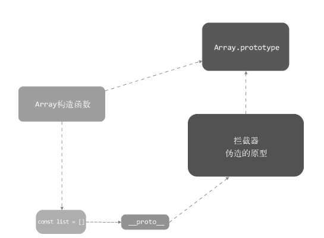

# vue.js是如何检测数组发生变化的

由于之前实现的数据侦测采用的是`Object.defineProperty`api，可以看到其实针对的是`Object`类型的数据，无论是多深的`object`，都能通过这api处理，如果是`Array`类型的数据，是无法检测数据变化的。那么vue.js中是如何侦测数组数据的呢

## 拦截器

试想下，如果我们想要侦测数组变化，实际上我们需要达成的效果是什么，是不是当数组被push了或者被pop了的时候通知相关地方进行相应操作

### 实现方式

在vue中，是通过拦截原型链来进行侦测数组变化，浏览器中，一个数组实例的`__proto__`指向`Array.prototype`，那么在vue中则是将`__proto__`指向一个拦截对象，而拦截对象的原型则是`Array.prototype`



代码如下
```js
const arrayProto = Array.prototype
const arrayMethods = Object.create(arrayProto)

['push', 'pop', 'shift', 'unshift', 'splice', 'sort', 'reverse']
  .forEach(method => {
    const originalMethods = arrayProto[method]
    Object.defineProperty(arrayMethods, method, {
      value: function mutator (...args) {
        return originalMethods.apply(this, args)
      },
      enumerable: false, 
      writable: true, 
      configurable: true
    })
  })
```

可以看到实际上调用对应原生api的时候，实际上调用的是也是原型上的方法，既保留了api的正常执行，也保留了侦测数据的操作空间

```js
class Observer {
  constructor(value) {
    if (Array.isArray(value)) {
      value.__proto__ = arrayMethods
    } else {
      this.walk(value)
    }
  }
}
```
